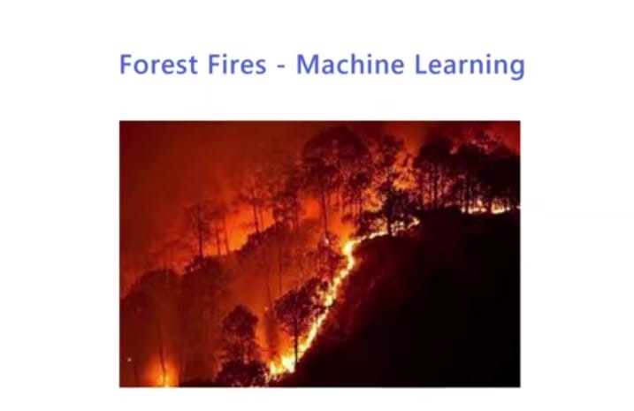

  
 

<i>

 Link- 

  <h3> What does this project entails? </h3>

Forest, bush or vegetation fire, can be described as any uncontrolled and non-prescribed combustion or burning of plants in a natural setting such as a forest, grassland, etc. In this project we are not determining if a Forest Fire will take place or not, we are predicting the confidence of the Forest Fire based on some attributes

 

  <h2>Details of the Project</h2>

The Project is divided into three parts:

1- Building a machine learning model to predict Forest Fire Confidence.  
2. We build a web app on Django to mount the prediction model.  
3. We deploy the Django project on Heroku through github.  

<h3> Machine Learning Model </h3>

So we start off with building a machine learning model using Random Forest Regression model and train that model using the dataset For this project you will also see Random SearchCV in action and how we have implemented it. 

 
  <h3>Django Web App </h3>

This is the second part where we build the web application using the framework Django We mount the model we build in the previous part on the django project 

 
<h3>Deploying on Heroku</h3>

This is the last part of the course where we will deploy the Django application on Heroku using the connections to github 

 
  
     
  
  <h1> Screenshots </h1>
  <h2> Input Screen </h2>
 
     
    
  
<h2> Output Screen </h2> 

   
    

 
### Give It a Star if you liked the project 
 </i>
